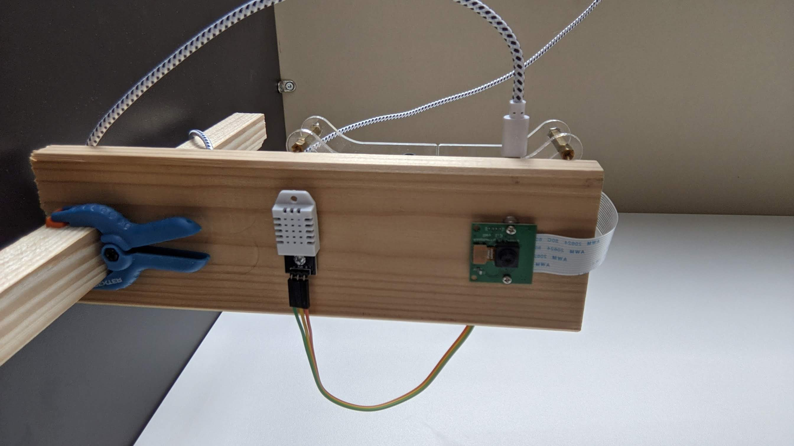

# `#growlab` app for Raspberry Pi

Record a timelapse and live preview image with sensor data from a DHT22 temperature and humidity sensor.


> The [@alexellisuk](https://twitter.com/alexellisuk) growlab preview

Inspired by the [Alex Ellis application](https://github.com/alexellis/growlab)

## Assembling the build

* You'll need a Raspberry Pi Zero W or any other Raspberry Pi.
* A DHT22 sensor connected to GND, VCC SDL and SCL.
* An RPi camera connected - any version

### Features [FR]

* prise de photo à interval régulier
* stockage des photos pour création d'un timelapse
* utilisation d'un sensor DHT22 (température et humidité) pour incruster dans les photos
* publier la dernière photo sur une github page

### Configuring the RPi

Using `raspi-config`

* Enable i2c under interfacing options
* Change the password for the `pi` user

### Getting started with the software

Install git :

```bash
sudo apt update -qy && \
  sudo apt install -qy git\
  python3 \
  python3-pip \
  libopenjp2-7 \
  libopenjp2-7-dev \
  libopenjp2-tools
```
> The `libopenjp2` package is for overlaying text on top of the images.


Install the project

```bash
# clone project
git clone https://github.com/amouchere/growlab-project


# Get the roboto font
cd growlab-project
curl -sSL https://github.com/googlefonts/roboto/releases/download/v2.138/roboto-unhinted.zip -o roboto.zip
unzip roboto.zip -d roboto
rm roboto.zip
```


Install Python modules with `pip3`:

```bash
sudo pip3 install -r requirements.txt
```

Capture a test image to determine if you need a horizontal or vertical flip or not:

```bash
# On the RPi
raspistill -o growlab.jpg

```

If needed, test again with `-vf` or `-hf` to flip the image.

Edit the `config.json` (flip if needed, preview repository path ..)

```json
{
    "time": {
        "interval_seconds": 600,
        "start": 8,
        "end": 20
    },
    "preview":{
        "git_dir":"/home/pi/growlab-preview",
        "git_path":"git@github.com:<>Your github here/growlab-preview.git"
    },
    "images": {
        "output_directory": "/home/pi/timelapse/",
        "encoding": "jpeg",
        "width": 2592,
        "height": 1944,
        "image_quality": 100,
        "preview_seconds": 1,
        "vertical_flip": true,
        "horizontal_flip": false,
        "meter_mode": "matrix"
    },
    "text": {
        "colour": {
            "red": 100,
            "green": 255,
            "blue": 100
        },
        "size": 52
    }
}

```

Test the code:

```bash
python3 app.py
```

### Serve a preview with GitHub pages

Configure GitHub pages in your own repo

Set the folder for serving content to "root"

### Install the service 


```bash 
sudo cp ~/growlab-project/growlab-project.service /etc/systemd/system/growlab-project.service
sudo systemctl enable growlab-project.service
sudo systemctl start growlab-project.service
```

### Hardware 

Some pictures of my growlab installation.

* Reclaimed wood
* Raspberry pi V2 with Wifi USB Stick
* PI Camera
* Temparature and Humidity sensor (DHT22)
* On/Off Button for shutdown the PI without opening an ssh session


> The wood structure


> The growlab


> A view from below with the camera and the DHT22 sensor